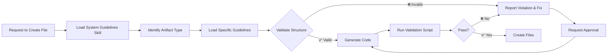

# System Guidelines Skill

This skill enforces strict architectural and coding standards for the Alpha Frontend Angular application following the modolithic architecture pattern.

## When to Use This Skill

Use this skill automatically before:
- Creating any new enum, DTO, service, or component
- Implementing new features or modules
- Refactoring existing code structure
- Validating code during reviews
- Ensuring naming conventions compliance

## Quick Validation

For immediate validation:
```bash
node .claude/skills/system-guidelines/scripts/check-guidelines.js
```

For specific artifact type:
```bash
node .claude/skills/system-guidelines/scripts/check-guidelines.js --type=component
```

## Validation Scope

This skill validates:

### 1. Enums
- ✅ File naming: `<name>.enum.ts` (lowercase with hyphens)
- ✅ Location: `model/private-domain/enum/`, `model/protected-domain/enum/`, or `model/public-domain/enum/`
- ✅ TypeScript enum declaration format (numeric auto-increment)
- ✅ PascalCase enum names
- ✅ SCREAMING_SNAKE_CASE values WITHOUT assignments
- ✅ NO string or explicit numeric assignments allowed
- ✅ Dedicated folder per enum
- 📖 **Details**: See [guidelines/enum-guidelines.md](guidelines/enum-guidelines.md)

### 2. DTOs (Data Transfer Objects)
- ✅ File naming: `<name>.dto.ts`
- ✅ Location: `model/dto/entity/` or `model/dto/api/`
- ✅ Base class inheritance: `DtoDetail` or `DtoDetailConfigurable`
- ✅ Proper field annotations
- ✅ Dedicated folder per DTO
- 📖 **Details**: See [guidelines/dto-guidelines.md](guidelines/dto-guidelines.md)

### 3. Services
- ✅ File naming: `<name>.service.ts`
- ✅ Location: `service/api/` or `service/domain/`
- ✅ Base class: `MvsCrudService` or `MvsHttpGeneric`
- ✅ `@Injectable({ providedIn: 'root' })`
- ✅ Entity provider registration
- ✅ Dedicated folder per service
- 📖 **Details**: See [guidelines/service-guidelines.md](guidelines/service-guidelines.md)

### 4. Components
- ✅ File naming: `<name>.component.ts`, `.html`, `.scss`
- ✅ Location: `component/<type>/` subdirectories
- ✅ **Separate files** (no inline templates/styles)
- ✅ `standalone: false` (NgModule architecture)
- ✅ Dedicated folder per component
- ✅ Visibility: private, protected, or public components
- ✅ Base class inheritance where applicable
- 📖 **Details**: See [guidelines/component-guidelines.md](guidelines/component-guidelines.md)

## Validation Process

When you request to create a new artifact, I will:

1. **Identify artifact type** (enum, DTO, service, or component)
2. **Load specific guidelines** from the appropriate reference file
3. **Validate naming convention** against project standards
4. **Verify folder structure** and location
5. **Check architectural compliance** (base classes, decorators, etc.)
6. **Ensure file separation** (no inline templates/styles)
7. **Validate module registration** (if applicable)
8. **Run validation script** for final verification

## Example: Creating a Component

When you ask to create a component, I will validate:

```typescript
// ✅ CORRECT Structure
features/feature-bm/bm/component/
  └── invoice-details/                    // ✅ Dedicated folder
      ├── invoice-details.component.ts    // ✅ Correct naming
      ├── invoice-details.component.html  // ✅ Separate HTML
      └── invoice-details.component.scss  // ✅ Separate SCSS

// ❌ WRONG Structure
features/feature-bm/bm/component/
  └── InvoiceDetails.component.ts         // ❌ Wrong naming (PascalCase)
  └── invoice-details.component.ts        // ❌ No dedicated folder
```

## Common Violations and Fixes

### Violation: Inline Template
```
❌ Found: template: `<div>...</div>` in component.ts

✅ Fix:
1. Create <name>.component.html
2. Move template content to .html file
3. Replace with: templateUrl: './<name>.component.html'
```

### Violation: Incorrect Naming
```
❌ Found: InvoiceService.ts (PascalCase)

✅ Fix: Rename to invoice.service.ts (lowercase with hyphens)
```

### Violation: Missing Dedicated Folder
```
❌ Found: component/invoice-list.component.ts

✅ Fix:
1. Create folder: component/invoice-list/
2. Move all files into folder
```

### Violation: Standalone Component
```
❌ Found: standalone: true

✅ Fix: Change to standalone: false (this project uses NgModules)
```

## Integration with Development Workflow



## Reference Documentation

All detailed guidelines are in separate files for easier maintenance:

- **[Enum Guidelines](guidelines/enum-guidelines.md)** - Complete enum creation rules
- **[DTO Guidelines](guidelines/dto-guidelines.md)** - DTO structure and inheritance
- **[Service Guidelines](guidelines/service-guidelines.md)** - Service patterns and registration
- **[Component Guidelines](guidelines/component-guidelines.md)** - Component architecture and visibility

For general project structure:
- **[General Documentation](../../general-documentation.md)** - Overall architecture
- **[Index](../../index.md)** - Documentation index

## Validation Script

The validation script performs comprehensive checks:

```bash
# Full validation
node .claude/skills/system-guidelines/scripts/check-guidelines.js

# Specific type
node .claude/skills/system-guidelines/scripts/check-guidelines.js --type=component

# Specific file
node .claude/skills/system-guidelines/scripts/check-guidelines.js --file=path/to/file.ts

# Generate report
node .claude/skills/system-guidelines/scripts/check-guidelines.js --report
```

## Best Practices for AI Assistants

1. **Always validate BEFORE creating files**
2. **Load specific guideline document** for the artifact type
3. **Cite guideline violations** with file and line references
4. **Provide concrete fixes** with step-by-step corrections
5. **Run validation script** after file creation
6. **Update module registration** when creating new modules

## Module-Specific Patterns

The project follows a modolithic architecture:

```
features/feature-<name>/
  └── <module-alias>/                    # 2-letter code (e.g., bm, tm, cr)
      ├── component/                     # Components
      │   ├── private-components/        # Module-only
      │   ├── protected-components/      # Feature-shared
      │   └── public-components/         # Cross-feature
      ├── interface/                     # Interfaces (one per file)
      ├── model/                         # DTOs and domain models
      │   ├── dto/
      │   │   ├── entity/               # Entity DTOs
      │   │   ├── api/                  # API DTOs
      │   │   └── enum/                 # DTO-related enums
      │   ├── private-domain/
      │   ├── protected-domain/
      │   └── public-domain/
      ├── service/
      │   ├── api/                      # CRUD services
      │   └── domain/                   # Business logic services
      ├── <alias>.module.ts             # Module definition
      ├── <alias>.route.ts              # Route definitions
      └── <alias>.entity-provider.ts    # Entity service registry
```

## Critical Rules

1. **No Standalone Components**: Always use `standalone: false`
2. **Separate Files**: Never use inline templates or styles
3. **Dedicated Folders**: Every artifact in its own folder
4. **Lowercase Naming**: File names use lowercase with hyphens
5. **Module Registration**: All modules registered in parent feature module
6. **Base Class Inheritance**: Follow inheritance patterns
7. **Visibility Rules**: Respect private/protected/public boundaries

## Success Criteria

A file passes validation when:
- ✅ Naming convention is correct
- ✅ Folder structure is proper
- ✅ Files are separated (no inline code)
- ✅ Base classes are used correctly
- ✅ Decorators are properly configured
- ✅ Module registration is complete
- ✅ Visibility rules are followed

## Support

For any guideline clarifications:
1. Check the specific guideline document
2. Review general-documentation.md
3. Examine component templates in `/projects/shell-alpha/src/app/templates`
4. Run validation script with `--verbose` flag

---

**Version**: 1.0.0
**Last Updated**: 2025-01-08
**Maintained by**: Alpha Frontend Team
